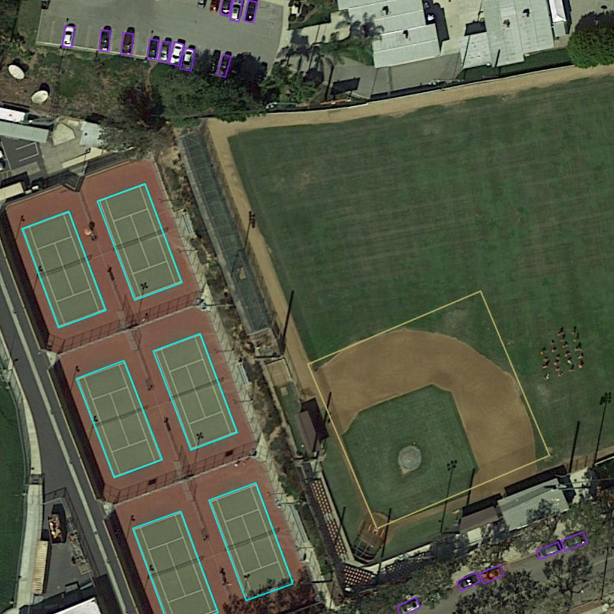
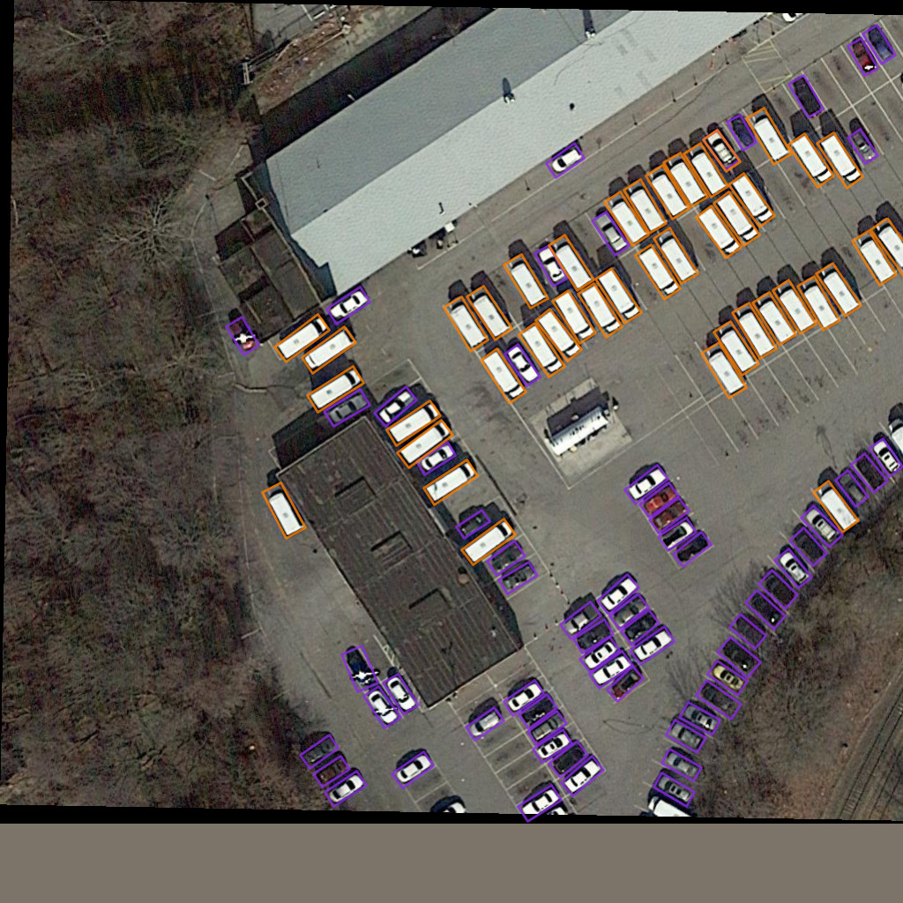
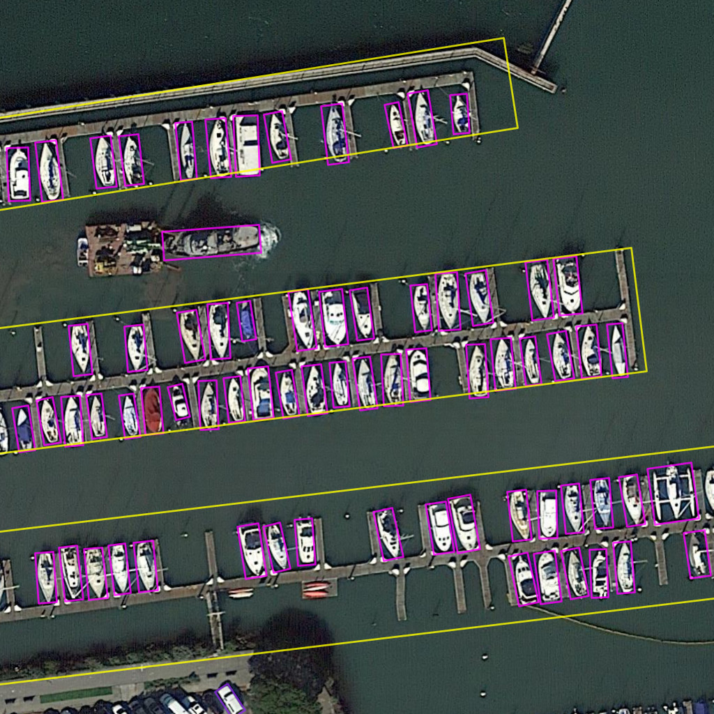
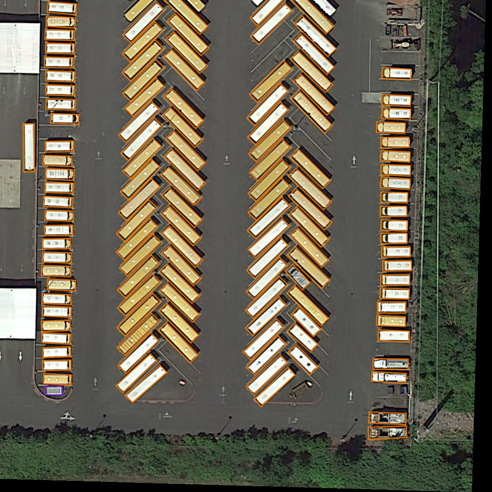

# HA-RDet
Hybrid-Anchor Rotation Detector for Oriented Object Detection

<p align="right">
    <video src=https://user-images.githubusercontent.com/108280892/203370570-04c74e03-675a-4514-96be-cc9dc3efc2a8.mp4>
</p>


<p>
    
</p>
<p>
    
</p>

# Introduction
Oriented object detection in aerial images gains significant attention in computer vision and pattern recognition. Current state-of-the-art two-stage or one-stage methods commonly adopt Anchor-based strategies for region proposal generation using a redundant number of generated anchors for training, which is inefficient for the limited resources. At the same time, Anchor-free approaches are much faster but usually diminish a large number of training samples, excoriating the detection accuracy. In this paper, we present the Hybrid-Anchor Rotation Detector (HA-RDet), which aims to bridge the gap between Anchor-based and Anchor-free schemes for oriented object detection. Extensive experiments of HA-RDet and many other detectors are carried out on many well-known oriented datasets such as DOTA, DIOR-R and HRSC2016. Our HA-RDet achieves state-of-the-art results, competitively comparable with current Anchor-based methods, while the training and inference speed is asymptotically similar to Anchor-free competitors.
# Benchmark and Model Zoo
## DOTA dataset
Baseline HA-RDet
| Model        | Backbone             | MS  |Rotate|mAP    |configs|
|--------------|:--------------------:|:---:|:----:|:-----:|:---------------------------------------------:|
|HA-RDet       |ResNet50+FPN          |  -  |   -  |75.408 |[configs](configs/HARDet/HA-RDet.py)                |
|HA-RDet       |ReResNet50+ReFPN      |  -  |   -  |75.676 |[configs](configs/HARDet/HA-RDet-reresnet.py)       |
|HA-RDet       |ResNext101_DCNv2+FPN  |  -  |   -  |77.012 |[configs](configs/HARDet/HA-RDet-resnext101.py)     |

High-quality detection HA-RDet
| Model                 | Backbone             | MS  |Rotate|mAP    |configs|
|-----------------------|:--------------------:|:---:|:----:|:-----:|:------------------------------------------------:|
|Oriented Cascade Head  |ResNet50+FPN          |  -  |   -  |46.64  |[configs](configs/HARDet/Cascade-HA-RDet.py)           |
|Oriented Dynamic Head  |ResNet50+FPN          |  -  |   -  |47.71  |[configs](configs/HARDet/HA-RDet-dynamictranning_05.py)|
## DIOR-R dataset
| Model        | Backbone             | MS  |Rotate|mAP    |configs|
|--------------|:--------------------:|:---:|:----:|:-----:|:----------------------------------------------------:|
|HA-RDet       |ResNext101_DCNv2+FPN  |  -  |   -  |65.3   |[configs](configs/HARDet/HA-RDet-resnext101-dior.py)       |

In order to execute DIOR-R dataset, change the dota.py .png to .jpg to retain the training scheme

## HRSC2016 dataset
| Model        | Backbone             | MS  |Rotate|mAP    |configs|
|--------------|:--------------------:|:---:|:----:|:-----:|:----------------------------------------------------:|
|HA-RDet       |ResNext101_DCNv2+FPN  |  -  |   -  |90.2   |[configs](configs/HARDet/HA-RDet-resnext101-hrsc.py)       |
# Installation

<summary> Data Tree </summary>

    HA-RDet
    ├── mmrotate
    ├── tools
    ├── configs
    ├── data
    │   ├── split_ss_dota
    │   │   ├── trainval
    │   │   ├── test
    │   ├── DIOR-R
    │   │   ├── trainval
    │   │   ├── test
    │   ├── HRSC
    │   │   ├── ImageSets
    │   │   ├── FullDataSets
Cloning repositories
```python
!git clone https://github.com/PhucNDA/HA-RDet.git
```
Install dependencies
```python
!pip install openmim
!mim install mmdet==2.25.0
!mim install mmrotate
!mim install mmcv==1.6.0
%cd HA-RDet
!pip install -v -e .
```
## Training Model
Single GPU
```python
python tools/train.py [configs_file] [optional args]
```
Multi GPU
```python
./tools/dist_train.sh [configs_file] [GPU_NUMS] [optional args]
```

## Testing Model
Submit to server: https://captain-whu.github.io/DOTA/evaluation.html
```python 
python ./tools/test.py  \
  [configs_file] \
  [checkpoint.pth] --format-only \
  --eval-options submission_dir=[submission_directories]
```
Visualization:

    We change the code to omit class name of the oriented bbox

```python
python tools/test.py [configs_file] --show-dir [visualization_directories]
```
